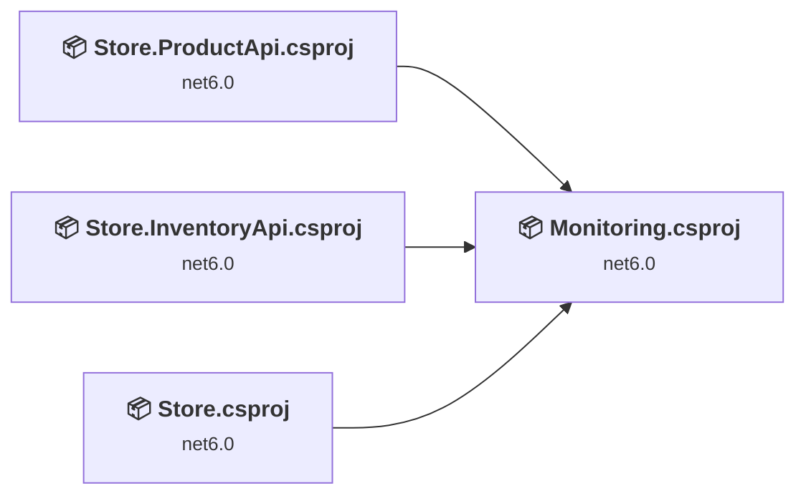
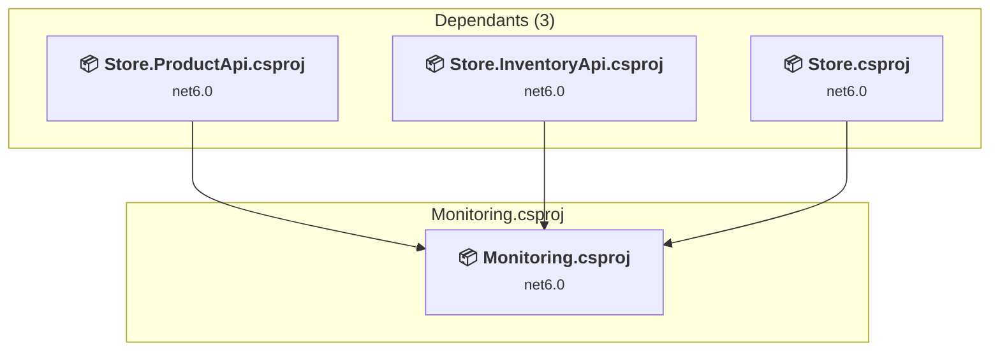
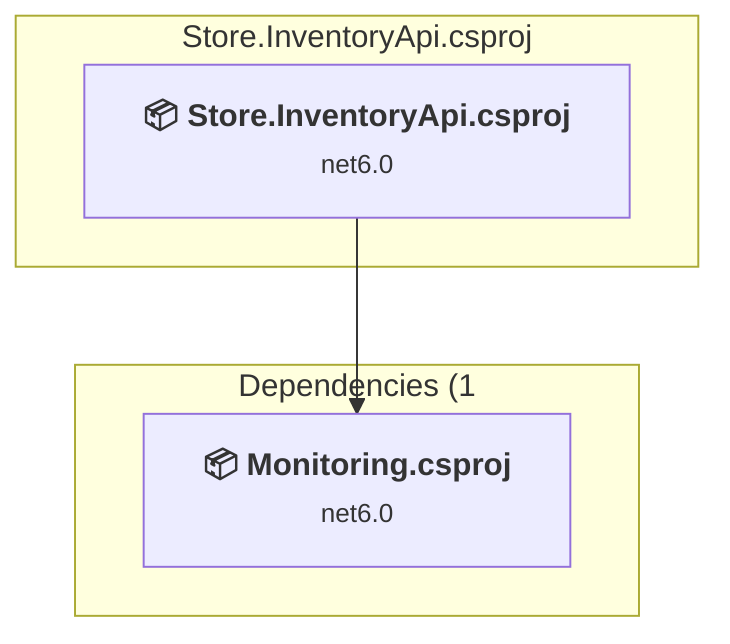
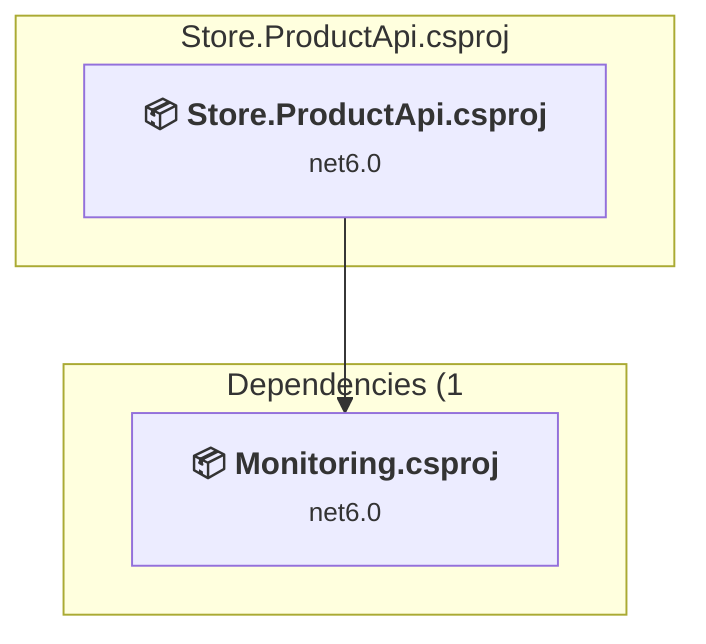
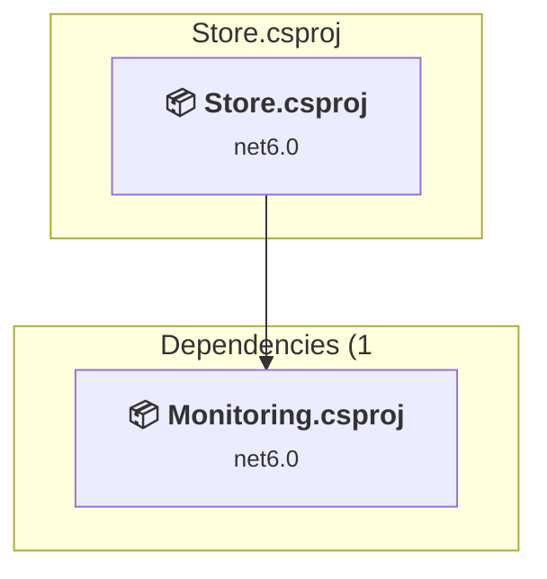

# Projects and dependencies analysis

This document provides a comprehensive overview of the projects and their dependencies in the context of upgrading to .NETCoreApp,Version=v10.0.

## Table of Contents

- [Executive Summary](#executive-Summary)
  - [Highlevel Metrics](#highlevel-metrics)
  - [Projects Compatibility](#projects-compatibility)
  - [Package Compatibility](#package-compatibility)
  - [API Compatibility](#api-compatibility)
  - [Binding Redirect Configuration](#binding-redirect-configuration)
- [Aggregate NuGet packages details](#aggregate-nuget-packages-details)
- [Top API Migration Challenges](#top-api-migration-challenges)
  - [Technologies and Features](#technologies-and-features)
  - [Most Frequent API Issues](#most-frequent-api-issues)
- [Projects Relationship Graph](#projects-relationship-graph)
- [Project Details](#project-details)

  - [Monitoring\Monitoring.csproj](#monitoringmonitoringcsproj)
  - [Store.InventoryApi\Store.InventoryApi.csproj](#storeinventoryapistoreinventoryapicsproj)
  - [Store.ProductApi\Store.ProductApi.csproj](#storeproductapistoreproductapicsproj)
  - [Store\Store.csproj](#storestorecsproj)

## Executive Summary

### Highlevel Metrics

| Metric | Count | Status |
| :--- | :---: | :--- |
| Total Projects | 4 | All require upgrade |
| Total NuGet Packages | 86 | 3 need upgrade |
| Total Code Files | 8 |  |
| Total Code Files with Incidents | 5 |  |
| Total Lines of Code | 280 |  |
| Total Number of Issues | 20 |  |
| Estimated LOC to modify | 11+ | at least 3,9% of codebase |

### Projects Compatibility

| Project | Target Framework | Difficulty | Package Issues | API Issues | Binding Issues | Est. LOC Impact | Description |
| :--- | :---: | :---: | :---: | :---: | :---: | :---: | :--- |
| [Monitoring\Monitoring.csproj](#monitoringmonitoringcsproj) | net6.0 | 🟢 Low | 1 | 0 | 0 |  | ClassLibrary, Sdk Style = True |
| [Store.InventoryApi\Store.InventoryApi.csproj](#storeinventoryapistoreinventoryapicsproj) | net6.0 | 🟢 Low | 1 | 0 | 0 |  | AspNetCore, Sdk Style = True |
| [Store.ProductApi\Store.ProductApi.csproj](#storeproductapistoreproductapicsproj) | net6.0 | 🟢 Low | 1 | 0 | 0 |  | AspNetCore, Sdk Style = True |
| [Store\Store.csproj](#storestorecsproj) | net6.0 | 🟢 Low | 2 | 11 | 0 | 11+ | AspNetCore, Sdk Style = True |

### Package Compatibility

| Status | Count | Percentage |
| :--- | :---: | :---: |
| ✅ Compatible | 83 | 96,5% |
| ⚠️ Incompatible | 2 | 2,3% |
| 🔄 Upgrade Recommended | 1 | 1,2% |
| ***Total NuGet Packages*** | ***86*** | ***100%*** |

### API Compatibility

| Category | Count | Impact |
| :--- | :---: | :--- |
| 🔴 Binary Incompatible | 2 | High - Require code changes |
| 🟡 Source Incompatible | 0 | Medium - Needs re-compilation and potential conflicting API error fixing |
| 🔵 Behavioral change | 9 | Low - Behavioral changes that may require testing at runtime |
| ✅ Compatible | 333 |  |
| ***Total APIs Analyzed*** | ***344*** |  |

## Aggregate NuGet packages details

| Package | Current Version | Suggested Version | Projects | Description |
| :--- | :---: | :---: | :--- | :--- |
| Bogus | 34.0.2 |  | [Store.ProductApi.csproj](#storeproductapistoreproductapicsproj) | ✅Compatible |
| Microsoft.ApplicationInsights | 2.20.0 |  | [Monitoring.csproj](#monitoringmonitoringcsproj) [Store.csproj](#storestorecsproj) [Store.InventoryApi.csproj](#storeinventoryapistoreinventoryapicsproj) [Store.ProductApi.csproj](#storeproductapistoreproductapicsproj) | ✅Compatible |
| Microsoft.ApplicationInsights.AspNetCore | 2.20.0 |  | [Monitoring.csproj](#monitoringmonitoringcsproj) [Store.csproj](#storestorecsproj) [Store.InventoryApi.csproj](#storeinventoryapistoreinventoryapicsproj) [Store.ProductApi.csproj](#storeproductapistoreproductapicsproj) | ⚠️NuGet package is deprecated |
| Microsoft.ApplicationInsights.DependencyCollector | 2.20.0 |  | [Monitoring.csproj](#monitoringmonitoringcsproj) [Store.csproj](#storestorecsproj) [Store.InventoryApi.csproj](#storeinventoryapistoreinventoryapicsproj) [Store.ProductApi.csproj](#storeproductapistoreproductapicsproj) | ✅Compatible |
| Microsoft.ApplicationInsights.EventCounterCollector | 2.20.0 |  | [Monitoring.csproj](#monitoringmonitoringcsproj) [Store.csproj](#storestorecsproj) [Store.InventoryApi.csproj](#storeinventoryapistoreinventoryapicsproj) [Store.ProductApi.csproj](#storeproductapistoreproductapicsproj) | ✅Compatible |
| Microsoft.ApplicationInsights.PerfCounterCollector | 2.20.0 |  | [Monitoring.csproj](#monitoringmonitoringcsproj) [Store.csproj](#storestorecsproj) [Store.InventoryApi.csproj](#storeinventoryapistoreinventoryapicsproj) [Store.ProductApi.csproj](#storeproductapistoreproductapicsproj) | ✅Compatible |
| Microsoft.ApplicationInsights.WindowsServer | 2.20.0 |  | [Monitoring.csproj](#monitoringmonitoringcsproj) [Store.csproj](#storestorecsproj) [Store.InventoryApi.csproj](#storeinventoryapistoreinventoryapicsproj) [Store.ProductApi.csproj](#storeproductapistoreproductapicsproj) | ✅Compatible |
| Microsoft.ApplicationInsights.WindowsServer.TelemetryChannel | 2.20.0 |  | [Monitoring.csproj](#monitoringmonitoringcsproj) [Store.csproj](#storestorecsproj) [Store.InventoryApi.csproj](#storeinventoryapistoreinventoryapicsproj) [Store.ProductApi.csproj](#storeproductapistoreproductapicsproj) | ✅Compatible |
| Microsoft.AspNetCore.Hosting | 2.1.1 |  | [Monitoring.csproj](#monitoringmonitoringcsproj) [Store.csproj](#storestorecsproj) [Store.InventoryApi.csproj](#storeinventoryapistoreinventoryapicsproj) [Store.ProductApi.csproj](#storeproductapistoreproductapicsproj) | ✅Compatible |
| Microsoft.AspNetCore.Hosting.Abstractions | 2.1.1 |  | [Monitoring.csproj](#monitoringmonitoringcsproj) [Store.csproj](#storestorecsproj) [Store.InventoryApi.csproj](#storeinventoryapistoreinventoryapicsproj) [Store.ProductApi.csproj](#storeproductapistoreproductapicsproj) | ✅Compatible |
| Microsoft.AspNetCore.Hosting.Server.Abstractions | 2.1.1 |  | [Monitoring.csproj](#monitoringmonitoringcsproj) [Store.csproj](#storestorecsproj) [Store.InventoryApi.csproj](#storeinventoryapistoreinventoryapicsproj) [Store.ProductApi.csproj](#storeproductapistoreproductapicsproj) | ✅Compatible |
| Microsoft.AspNetCore.Http | 2.1.22 |  | [Monitoring.csproj](#monitoringmonitoringcsproj) [Store.csproj](#storestorecsproj) [Store.InventoryApi.csproj](#storeinventoryapistoreinventoryapicsproj) [Store.ProductApi.csproj](#storeproductapistoreproductapicsproj) | ✅Compatible |
| Microsoft.AspNetCore.Http.Abstractions | 2.1.1 |  | [Monitoring.csproj](#monitoringmonitoringcsproj) [Store.csproj](#storestorecsproj) [Store.InventoryApi.csproj](#storeinventoryapistoreinventoryapicsproj) [Store.ProductApi.csproj](#storeproductapistoreproductapicsproj) | ✅Compatible |
| Microsoft.AspNetCore.Http.Extensions | 2.1.1 |  | [Monitoring.csproj](#monitoringmonitoringcsproj) [Store.csproj](#storestorecsproj) [Store.InventoryApi.csproj](#storeinventoryapistoreinventoryapicsproj) [Store.ProductApi.csproj](#storeproductapistoreproductapicsproj) | ✅Compatible |
| Microsoft.AspNetCore.Http.Features | 2.1.1 |  | [Monitoring.csproj](#monitoringmonitoringcsproj) [Store.csproj](#storestorecsproj) [Store.InventoryApi.csproj](#storeinventoryapistoreinventoryapicsproj) [Store.ProductApi.csproj](#storeproductapistoreproductapicsproj) | ✅Compatible |
| Microsoft.AspNetCore.WebUtilities | 2.1.1 |  | [Monitoring.csproj](#monitoringmonitoringcsproj) [Store.csproj](#storestorecsproj) [Store.InventoryApi.csproj](#storeinventoryapistoreinventoryapicsproj) [Store.ProductApi.csproj](#storeproductapistoreproductapicsproj) | ✅Compatible |
| Microsoft.Extensions.ApiDescription.Server | 3.0.0 |  | [Store.InventoryApi.csproj](#storeinventoryapistoreinventoryapicsproj) [Store.ProductApi.csproj](#storeproductapistoreproductapicsproj) | ✅Compatible |
| Microsoft.Extensions.Caching.Abstractions | 1.0.0 |  | [Monitoring.csproj](#monitoringmonitoringcsproj) [Store.csproj](#storestorecsproj) [Store.InventoryApi.csproj](#storeinventoryapistoreinventoryapicsproj) [Store.ProductApi.csproj](#storeproductapistoreproductapicsproj) | ✅Compatible |
| Microsoft.Extensions.Caching.Memory | 1.0.0 |  | [Monitoring.csproj](#monitoringmonitoringcsproj) [Store.csproj](#storestorecsproj) [Store.InventoryApi.csproj](#storeinventoryapistoreinventoryapicsproj) [Store.ProductApi.csproj](#storeproductapistoreproductapicsproj) | ✅Compatible |
| Microsoft.Extensions.Configuration | 2.1.1 |  | [Monitoring.csproj](#monitoringmonitoringcsproj) [Store.csproj](#storestorecsproj) [Store.InventoryApi.csproj](#storeinventoryapistoreinventoryapicsproj) [Store.ProductApi.csproj](#storeproductapistoreproductapicsproj) | ✅Compatible |
| Microsoft.Extensions.Configuration.Abstractions | 2.1.1 |  | [Monitoring.csproj](#monitoringmonitoringcsproj) [Store.csproj](#storestorecsproj) [Store.InventoryApi.csproj](#storeinventoryapistoreinventoryapicsproj) [Store.ProductApi.csproj](#storeproductapistoreproductapicsproj) | ✅Compatible |
| Microsoft.Extensions.Configuration.Binder | 2.1.1 |  | [Monitoring.csproj](#monitoringmonitoringcsproj) [Store.csproj](#storestorecsproj) [Store.InventoryApi.csproj](#storeinventoryapistoreinventoryapicsproj) [Store.ProductApi.csproj](#storeproductapistoreproductapicsproj) | ✅Compatible |
| Microsoft.Extensions.Configuration.EnvironmentVariables | 2.1.1 |  | [Monitoring.csproj](#monitoringmonitoringcsproj) [Store.csproj](#storestorecsproj) [Store.InventoryApi.csproj](#storeinventoryapistoreinventoryapicsproj) [Store.ProductApi.csproj](#storeproductapistoreproductapicsproj) | ✅Compatible |
| Microsoft.Extensions.Configuration.FileExtensions | 2.1.1 |  | [Monitoring.csproj](#monitoringmonitoringcsproj) [Store.csproj](#storestorecsproj) [Store.InventoryApi.csproj](#storeinventoryapistoreinventoryapicsproj) [Store.ProductApi.csproj](#storeproductapistoreproductapicsproj) | ✅Compatible |
| Microsoft.Extensions.Configuration.Json | 2.1.0 |  | [Monitoring.csproj](#monitoringmonitoringcsproj) [Store.csproj](#storestorecsproj) [Store.InventoryApi.csproj](#storeinventoryapistoreinventoryapicsproj) [Store.ProductApi.csproj](#storeproductapistoreproductapicsproj) | ✅Compatible |
| Microsoft.Extensions.DependencyInjection | 2.1.1 |  | [Monitoring.csproj](#monitoringmonitoringcsproj) [Store.csproj](#storestorecsproj) [Store.InventoryApi.csproj](#storeinventoryapistoreinventoryapicsproj) [Store.ProductApi.csproj](#storeproductapistoreproductapicsproj) | ✅Compatible |
| Microsoft.Extensions.DependencyInjection.Abstractions | 2.1.1 |  | [Monitoring.csproj](#monitoringmonitoringcsproj) [Store.csproj](#storestorecsproj) [Store.InventoryApi.csproj](#storeinventoryapistoreinventoryapicsproj) [Store.ProductApi.csproj](#storeproductapistoreproductapicsproj) | ✅Compatible |
| Microsoft.Extensions.FileProviders.Abstractions | 2.1.1 |  | [Monitoring.csproj](#monitoringmonitoringcsproj) [Store.csproj](#storestorecsproj) [Store.InventoryApi.csproj](#storeinventoryapistoreinventoryapicsproj) [Store.ProductApi.csproj](#storeproductapistoreproductapicsproj) | ✅Compatible |
| Microsoft.Extensions.FileProviders.Physical | 2.1.1 |  | [Monitoring.csproj](#monitoringmonitoringcsproj) [Store.csproj](#storestorecsproj) [Store.InventoryApi.csproj](#storeinventoryapistoreinventoryapicsproj) [Store.ProductApi.csproj](#storeproductapistoreproductapicsproj) | ✅Compatible |
| Microsoft.Extensions.FileSystemGlobbing | 2.1.1 |  | [Monitoring.csproj](#monitoringmonitoringcsproj) [Store.csproj](#storestorecsproj) [Store.InventoryApi.csproj](#storeinventoryapistoreinventoryapicsproj) [Store.ProductApi.csproj](#storeproductapistoreproductapicsproj) | ✅Compatible |
| Microsoft.Extensions.Hosting.Abstractions | 2.1.1 |  | [Monitoring.csproj](#monitoringmonitoringcsproj) [Store.csproj](#storestorecsproj) [Store.InventoryApi.csproj](#storeinventoryapistoreinventoryapicsproj) [Store.ProductApi.csproj](#storeproductapistoreproductapicsproj) | ✅Compatible |
| Microsoft.Extensions.Logging | 2.1.1 |  | [Monitoring.csproj](#monitoringmonitoringcsproj) [Store.csproj](#storestorecsproj) [Store.InventoryApi.csproj](#storeinventoryapistoreinventoryapicsproj) [Store.ProductApi.csproj](#storeproductapistoreproductapicsproj) | ✅Compatible |
| Microsoft.Extensions.Logging.Abstractions | 2.1.1 |  | [Monitoring.csproj](#monitoringmonitoringcsproj) [Store.csproj](#storestorecsproj) [Store.InventoryApi.csproj](#storeinventoryapistoreinventoryapicsproj) [Store.ProductApi.csproj](#storeproductapistoreproductapicsproj) | ✅Compatible |
| Microsoft.Extensions.Logging.ApplicationInsights | 2.20.0 |  | [Monitoring.csproj](#monitoringmonitoringcsproj) [Store.csproj](#storestorecsproj) [Store.InventoryApi.csproj](#storeinventoryapistoreinventoryapicsproj) [Store.ProductApi.csproj](#storeproductapistoreproductapicsproj) | ✅Compatible |
| Microsoft.Extensions.ObjectPool | 2.1.1 |  | [Monitoring.csproj](#monitoringmonitoringcsproj) [Store.csproj](#storestorecsproj) [Store.InventoryApi.csproj](#storeinventoryapistoreinventoryapicsproj) [Store.ProductApi.csproj](#storeproductapistoreproductapicsproj) | ✅Compatible |
| Microsoft.Extensions.Options | 2.1.1 |  | [Monitoring.csproj](#monitoringmonitoringcsproj) [Store.csproj](#storestorecsproj) [Store.InventoryApi.csproj](#storeinventoryapistoreinventoryapicsproj) [Store.ProductApi.csproj](#storeproductapistoreproductapicsproj) | ✅Compatible |
| Microsoft.Extensions.Primitives | 2.1.1 |  | [Monitoring.csproj](#monitoringmonitoringcsproj) [Store.csproj](#storestorecsproj) [Store.InventoryApi.csproj](#storeinventoryapistoreinventoryapicsproj) [Store.ProductApi.csproj](#storeproductapistoreproductapicsproj) | ✅Compatible |
| Microsoft.Net.Http.Headers | 2.1.1 |  | [Monitoring.csproj](#monitoringmonitoringcsproj) [Store.csproj](#storestorecsproj) [Store.InventoryApi.csproj](#storeinventoryapistoreinventoryapicsproj) [Store.ProductApi.csproj](#storeproductapistoreproductapicsproj) | ✅Compatible |
| Microsoft.NETCore.Platforms | 3.1.0 |  | [Monitoring.csproj](#monitoringmonitoringcsproj) [Store.csproj](#storestorecsproj) [Store.InventoryApi.csproj](#storeinventoryapistoreinventoryapicsproj) [Store.ProductApi.csproj](#storeproductapistoreproductapicsproj) | ✅Compatible |
| Microsoft.NETCore.Targets | 1.1.0 |  | [Monitoring.csproj](#monitoringmonitoringcsproj) [Store.csproj](#storestorecsproj) [Store.InventoryApi.csproj](#storeinventoryapistoreinventoryapicsproj) [Store.ProductApi.csproj](#storeproductapistoreproductapicsproj) | ✅Compatible |
| Microsoft.OpenApi | 1.2.3 |  | [Store.InventoryApi.csproj](#storeinventoryapistoreinventoryapicsproj) [Store.ProductApi.csproj](#storeproductapistoreproductapicsproj) | ✅Compatible |
| Microsoft.VisualStudio.Azure.Containers.Tools.Targets | 1.15.1 |  | [Store.csproj](#storestorecsproj) [Store.InventoryApi.csproj](#storeinventoryapistoreinventoryapicsproj) [Store.ProductApi.csproj](#storeproductapistoreproductapicsproj) | ⚠️NuGet package is incompatible |
| Microsoft.Win32.Registry | 4.7.0 |  | [Monitoring.csproj](#monitoringmonitoringcsproj) [Store.csproj](#storestorecsproj) [Store.InventoryApi.csproj](#storeinventoryapistoreinventoryapicsproj) [Store.ProductApi.csproj](#storeproductapistoreproductapicsproj) | ✅Compatible |
| Microsoft.Win32.SystemEvents | 4.7.0 |  | [Monitoring.csproj](#monitoringmonitoringcsproj) [Store.csproj](#storestorecsproj) [Store.InventoryApi.csproj](#storeinventoryapistoreinventoryapicsproj) [Store.ProductApi.csproj](#storeproductapistoreproductapicsproj) | ✅Compatible |
| Newtonsoft.Json | 11.0.2 |  | [Monitoring.csproj](#monitoringmonitoringcsproj) [Store.csproj](#storestorecsproj) [Store.InventoryApi.csproj](#storeinventoryapistoreinventoryapicsproj) [Store.ProductApi.csproj](#storeproductapistoreproductapicsproj) | ✅Compatible |
| Refit | 6.3.2 | 13.1.0 | [Store.csproj](#storestorecsproj) | NuGet package contains security vulnerability |
| Swashbuckle.AspNetCore | 6.2.3 |  | [Store.InventoryApi.csproj](#storeinventoryapistoreinventoryapicsproj) [Store.ProductApi.csproj](#storeproductapistoreproductapicsproj) | ✅Compatible |
| Swashbuckle.AspNetCore.Swagger | 6.2.3 |  | [Store.InventoryApi.csproj](#storeinventoryapistoreinventoryapicsproj) [Store.ProductApi.csproj](#storeproductapistoreproductapicsproj) | ✅Compatible |
| Swashbuckle.AspNetCore.SwaggerGen | 6.2.3 |  | [Store.InventoryApi.csproj](#storeinventoryapistoreinventoryapicsproj) [Store.ProductApi.csproj](#storeproductapistoreproductapicsproj) | ✅Compatible |
| Swashbuckle.AspNetCore.SwaggerUI | 6.2.3 |  | [Store.InventoryApi.csproj](#storeinventoryapistoreinventoryapicsproj) [Store.ProductApi.csproj](#storeproductapistoreproductapicsproj) | ✅Compatible |
| System.Buffers | 4.5.0 |  | [Monitoring.csproj](#monitoringmonitoringcsproj) [Store.csproj](#storestorecsproj) [Store.InventoryApi.csproj](#storeinventoryapistoreinventoryapicsproj) [Store.ProductApi.csproj](#storeproductapistoreproductapicsproj) | ✅Compatible |
| System.Collections | 4.0.11 |  | [Monitoring.csproj](#monitoringmonitoringcsproj) [Store.csproj](#storestorecsproj) [Store.InventoryApi.csproj](#storeinventoryapistoreinventoryapicsproj) [Store.ProductApi.csproj](#storeproductapistoreproductapicsproj) | ✅Compatible |
| System.Configuration.ConfigurationManager | 4.7.0 |  | [Monitoring.csproj](#monitoringmonitoringcsproj) [Store.csproj](#storestorecsproj) [Store.InventoryApi.csproj](#storeinventoryapistoreinventoryapicsproj) [Store.ProductApi.csproj](#storeproductapistoreproductapicsproj) | ✅Compatible |
| System.Diagnostics.Debug | 4.0.11 |  | [Monitoring.csproj](#monitoringmonitoringcsproj) [Store.csproj](#storestorecsproj) [Store.InventoryApi.csproj](#storeinventoryapistoreinventoryapicsproj) [Store.ProductApi.csproj](#storeproductapistoreproductapicsproj) | ✅Compatible |
| System.Diagnostics.DiagnosticSource | 5.0.0 |  | [Monitoring.csproj](#monitoringmonitoringcsproj) [Store.csproj](#storestorecsproj) [Store.InventoryApi.csproj](#storeinventoryapistoreinventoryapicsproj) [Store.ProductApi.csproj](#storeproductapistoreproductapicsproj) | ✅Compatible |
| System.Diagnostics.PerformanceCounter | 4.7.0 |  | [Monitoring.csproj](#monitoringmonitoringcsproj) [Store.csproj](#storestorecsproj) [Store.InventoryApi.csproj](#storeinventoryapistoreinventoryapicsproj) [Store.ProductApi.csproj](#storeproductapistoreproductapicsproj) | ✅Compatible |
| System.Diagnostics.StackTrace | 4.3.0 |  | [Monitoring.csproj](#monitoringmonitoringcsproj) [Store.csproj](#storestorecsproj) [Store.InventoryApi.csproj](#storeinventoryapistoreinventoryapicsproj) [Store.ProductApi.csproj](#storeproductapistoreproductapicsproj) | ✅Compatible |
| System.Drawing.Common | 4.7.0 |  | [Monitoring.csproj](#monitoringmonitoringcsproj) [Store.csproj](#storestorecsproj) [Store.InventoryApi.csproj](#storeinventoryapistoreinventoryapicsproj) [Store.ProductApi.csproj](#storeproductapistoreproductapicsproj) | ✅Compatible |
| System.Globalization | 4.0.11 |  | [Monitoring.csproj](#monitoringmonitoringcsproj) [Store.csproj](#storestorecsproj) [Store.InventoryApi.csproj](#storeinventoryapistoreinventoryapicsproj) [Store.ProductApi.csproj](#storeproductapistoreproductapicsproj) | ✅Compatible |
| System.IO | 4.3.0 |  | [Monitoring.csproj](#monitoringmonitoringcsproj) [Store.csproj](#storestorecsproj) [Store.InventoryApi.csproj](#storeinventoryapistoreinventoryapicsproj) [Store.ProductApi.csproj](#storeproductapistoreproductapicsproj) | ✅Compatible |
| System.IO.FileSystem | 4.3.0 |  | [Monitoring.csproj](#monitoringmonitoringcsproj) [Store.csproj](#storestorecsproj) [Store.InventoryApi.csproj](#storeinventoryapistoreinventoryapicsproj) [Store.ProductApi.csproj](#storeproductapistoreproductapicsproj) | ✅Compatible |
| System.IO.FileSystem.AccessControl | 4.7.0 |  | [Monitoring.csproj](#monitoringmonitoringcsproj) [Store.csproj](#storestorecsproj) [Store.InventoryApi.csproj](#storeinventoryapistoreinventoryapicsproj) [Store.ProductApi.csproj](#storeproductapistoreproductapicsproj) | ✅Compatible |
| System.IO.FileSystem.Primitives | 4.3.0 |  | [Monitoring.csproj](#monitoringmonitoringcsproj) [Store.csproj](#storestorecsproj) [Store.InventoryApi.csproj](#storeinventoryapistoreinventoryapicsproj) [Store.ProductApi.csproj](#storeproductapistoreproductapicsproj) | ✅Compatible |
| System.Linq | 4.1.0 |  | [Monitoring.csproj](#monitoringmonitoringcsproj) [Store.csproj](#storestorecsproj) [Store.InventoryApi.csproj](#storeinventoryapistoreinventoryapicsproj) [Store.ProductApi.csproj](#storeproductapistoreproductapicsproj) | ✅Compatible |
| System.Memory | 4.5.1 |  | [Monitoring.csproj](#monitoringmonitoringcsproj) [Store.csproj](#storestorecsproj) [Store.InventoryApi.csproj](#storeinventoryapistoreinventoryapicsproj) [Store.ProductApi.csproj](#storeproductapistoreproductapicsproj) | ✅Compatible |
| System.Net.Http.Json | 6.0.0 |  | [Store.csproj](#storestorecsproj) | ✅Compatible |
| System.Reflection | 4.3.0 |  | [Monitoring.csproj](#monitoringmonitoringcsproj) [Store.csproj](#storestorecsproj) [Store.InventoryApi.csproj](#storeinventoryapistoreinventoryapicsproj) [Store.ProductApi.csproj](#storeproductapistoreproductapicsproj) | ✅Compatible |
| System.Reflection.Metadata | 1.6.0 |  | [Monitoring.csproj](#monitoringmonitoringcsproj) [Store.csproj](#storestorecsproj) [Store.InventoryApi.csproj](#storeinventoryapistoreinventoryapicsproj) [Store.ProductApi.csproj](#storeproductapistoreproductapicsproj) | ✅Compatible |
| System.Reflection.Primitives | 4.3.0 |  | [Monitoring.csproj](#monitoringmonitoringcsproj) [Store.csproj](#storestorecsproj) [Store.InventoryApi.csproj](#storeinventoryapistoreinventoryapicsproj) [Store.ProductApi.csproj](#storeproductapistoreproductapicsproj) | ✅Compatible |
| System.Resources.ResourceManager | 4.0.1 |  | [Monitoring.csproj](#monitoringmonitoringcsproj) [Store.csproj](#storestorecsproj) [Store.InventoryApi.csproj](#storeinventoryapistoreinventoryapicsproj) [Store.ProductApi.csproj](#storeproductapistoreproductapicsproj) | ✅Compatible |
| System.Runtime | 4.3.0 |  | [Monitoring.csproj](#monitoringmonitoringcsproj) [Store.csproj](#storestorecsproj) [Store.InventoryApi.csproj](#storeinventoryapistoreinventoryapicsproj) [Store.ProductApi.csproj](#storeproductapistoreproductapicsproj) | ✅Compatible |
| System.Runtime.CompilerServices.Unsafe | 4.5.1 |  | [Monitoring.csproj](#monitoringmonitoringcsproj) [Store.InventoryApi.csproj](#storeinventoryapistoreinventoryapicsproj) [Store.ProductApi.csproj](#storeproductapistoreproductapicsproj) | ✅Compatible |
| System.Runtime.CompilerServices.Unsafe | 6.0.0 |  | [Store.csproj](#storestorecsproj) | ✅Compatible |
| System.Runtime.Extensions | 4.1.0 |  | [Monitoring.csproj](#monitoringmonitoringcsproj) [Store.csproj](#storestorecsproj) [Store.InventoryApi.csproj](#storeinventoryapistoreinventoryapicsproj) [Store.ProductApi.csproj](#storeproductapistoreproductapicsproj) | ✅Compatible |
| System.Runtime.Handles | 4.3.0 |  | [Monitoring.csproj](#monitoringmonitoringcsproj) [Store.csproj](#storestorecsproj) [Store.InventoryApi.csproj](#storeinventoryapistoreinventoryapicsproj) [Store.ProductApi.csproj](#storeproductapistoreproductapicsproj) | ✅Compatible |
| System.Security.AccessControl | 4.7.0 |  | [Monitoring.csproj](#monitoringmonitoringcsproj) [Store.csproj](#storestorecsproj) [Store.InventoryApi.csproj](#storeinventoryapistoreinventoryapicsproj) [Store.ProductApi.csproj](#storeproductapistoreproductapicsproj) | ✅Compatible |
| System.Security.Cryptography.ProtectedData | 4.7.0 |  | [Monitoring.csproj](#monitoringmonitoringcsproj) [Store.csproj](#storestorecsproj) [Store.InventoryApi.csproj](#storeinventoryapistoreinventoryapicsproj) [Store.ProductApi.csproj](#storeproductapistoreproductapicsproj) | ✅Compatible |
| System.Security.Permissions | 4.7.0 |  | [Monitoring.csproj](#monitoringmonitoringcsproj) [Store.csproj](#storestorecsproj) [Store.InventoryApi.csproj](#storeinventoryapistoreinventoryapicsproj) [Store.ProductApi.csproj](#storeproductapistoreproductapicsproj) | ✅Compatible |
| System.Security.Principal.Windows | 4.7.0 |  | [Monitoring.csproj](#monitoringmonitoringcsproj) [Store.csproj](#storestorecsproj) [Store.InventoryApi.csproj](#storeinventoryapistoreinventoryapicsproj) [Store.ProductApi.csproj](#storeproductapistoreproductapicsproj) | ✅Compatible |
| System.Text.Encoding | 4.3.0 |  | [Monitoring.csproj](#monitoringmonitoringcsproj) [Store.csproj](#storestorecsproj) [Store.InventoryApi.csproj](#storeinventoryapistoreinventoryapicsproj) [Store.ProductApi.csproj](#storeproductapistoreproductapicsproj) | ✅Compatible |
| System.Text.Encodings.Web | 4.5.1 |  | [Monitoring.csproj](#monitoringmonitoringcsproj) [Store.InventoryApi.csproj](#storeinventoryapistoreinventoryapicsproj) [Store.ProductApi.csproj](#storeproductapistoreproductapicsproj) | ✅Compatible |
| System.Text.Encodings.Web | 6.0.0 |  | [Store.csproj](#storestorecsproj) | ✅Compatible |
| System.Text.Json | 6.0.0 |  | [Store.csproj](#storestorecsproj) | ✅Compatible |
| System.Threading | 4.0.11 |  | [Monitoring.csproj](#monitoringmonitoringcsproj) [Store.csproj](#storestorecsproj) [Store.InventoryApi.csproj](#storeinventoryapistoreinventoryapicsproj) [Store.ProductApi.csproj](#storeproductapistoreproductapicsproj) | ✅Compatible |
| System.Threading.Tasks | 4.3.0 |  | [Monitoring.csproj](#monitoringmonitoringcsproj) [Store.csproj](#storestorecsproj) [Store.InventoryApi.csproj](#storeinventoryapistoreinventoryapicsproj) [Store.ProductApi.csproj](#storeproductapistoreproductapicsproj) | ✅Compatible |
| System.Windows.Extensions | 4.7.0 |  | [Monitoring.csproj](#monitoringmonitoringcsproj) [Store.csproj](#storestorecsproj) [Store.InventoryApi.csproj](#storeinventoryapistoreinventoryapicsproj) [Store.ProductApi.csproj](#storeproductapistoreproductapicsproj) | ✅Compatible |

## Top API Migration Challenges

### Technologies and Features

| Technology | Issues | Percentage | Migration Path |
| :--- | :---: | :---: | :--- |

### Most Frequent API Issues

| API | Count | Percentage | Category |
| :--- | :---: | :---: | :--- |
| T:System.Uri | 4 | 36,4% | Behavioral Change |
| M:Microsoft.Extensions.Configuration.ConfigurationBinder.GetValue''1(Microsoft.Extensions.Configuration.IConfiguration,System.String) | 2 | 18,2% | Binary Incompatible |
| M:System.Uri.#ctor(System.String) | 2 | 18,2% | Behavioral Change |
| M:Microsoft.Extensions.DependencyInjection.HttpClientFactoryServiceCollectionExtensions.AddHttpClient(Microsoft.Extensions.DependencyInjection.IServiceCollection,System.String,System.Action{System.Net.Http.HttpClient}) | 2 | 18,2% | Behavioral Change |
| M:Microsoft.AspNetCore.Builder.ExceptionHandlerExtensions.UseExceptionHandler(Microsoft.AspNetCore.Builder.IApplicationBuilder,System.String) | 1 | 9,1% | Behavioral Change |

## Projects Relationship Graph

Legend:
📦 SDK-style project
⚙️ Classic project

## Project Details

### Monitoring\Monitoring.csproj

#### Project Info

- **Current Target Framework:** net6.0
- **Proposed Target Framework:** net10.0
- **SDK-style**: True
- **Project Kind:** ClassLibrary
- **Dependencies**: 0
- **Dependants**: 3
- **Number of Files**: 1
- **Number of Files with Incidents**: 1
- **Lines of Code**: 36
- **Estimated LOC to modify**: 0+ (at least 0,0% of the project)

#### Dependency Graph

Legend:
📦 SDK-style project
⚙️ Classic project

### API Compatibility

| Category | Count | Impact |
| :--- | :---: | :--- |
| 🔴 Binary Incompatible | 0 | High - Require code changes |
| 🟡 Source Incompatible | 0 | Medium - Needs re-compilation and potential conflicting API error fixing |
| 🔵 Behavioral change | 0 | Low - Behavioral changes that may require testing at runtime |
| ✅ Compatible | 36 |  |
| ***Total APIs Analyzed*** | ***36*** |  |

### Store.InventoryApi\Store.InventoryApi.csproj

#### Project Info

- **Current Target Framework:** net6.0
- **Proposed Target Framework:** net10.0
- **SDK-style**: True
- **Project Kind:** AspNetCore
- **Dependencies**: 1
- **Dependants**: 0
- **Number of Files**: 3
- **Number of Files with Incidents**: 1
- **Lines of Code**: 36
- **Estimated LOC to modify**: 0+ (at least 0,0% of the project)

#### Dependency Graph

Legend:
📦 SDK-style project
⚙️ Classic project

### API Compatibility

| Category | Count | Impact |
| :--- | :---: | :--- |
| 🔴 Binary Incompatible | 0 | High - Require code changes |
| 🟡 Source Incompatible | 0 | Medium - Needs re-compilation and potential conflicting API error fixing |
| 🔵 Behavioral change | 0 | Low - Behavioral changes that may require testing at runtime |
| ✅ Compatible | 65 |  |
| ***Total APIs Analyzed*** | ***65*** |  |

### Store.ProductApi\Store.ProductApi.csproj

#### Project Info

- **Current Target Framework:** net6.0
- **Proposed Target Framework:** net10.0
- **SDK-style**: True
- **Project Kind:** AspNetCore
- **Dependencies**: 1
- **Dependants**: 0
- **Number of Files**: 3
- **Number of Files with Incidents**: 1
- **Lines of Code**: 34
- **Estimated LOC to modify**: 0+ (at least 0,0% of the project)

#### Dependency Graph

Legend:
📦 SDK-style project
⚙️ Classic project

### API Compatibility

| Category | Count | Impact |
| :--- | :---: | :--- |
| 🔴 Binary Incompatible | 0 | High - Require code changes |
| 🟡 Source Incompatible | 0 | Medium - Needs re-compilation and potential conflicting API error fixing |
| 🔵 Behavioral change | 0 | Low - Behavioral changes that may require testing at runtime |
| ✅ Compatible | 78 |  |
| ***Total APIs Analyzed*** | ***78*** |  |

### Store\Store.csproj

#### Project Info

- **Current Target Framework:** net6.0
- **Proposed Target Framework:** net10.0
- **SDK-style**: True
- **Project Kind:** AspNetCore
- **Dependencies**: 1
- **Dependants**: 0
- **Number of Files**: 25
- **Number of Files with Incidents**: 2
- **Lines of Code**: 174
- **Estimated LOC to modify**: 11+ (at least 6,3% of the project)

#### Dependency Graph

Legend:
📦 SDK-style project
⚙️ Classic project

### API Compatibility

| Category | Count | Impact |
| :--- | :---: | :--- |
| 🔴 Binary Incompatible | 2 | High - Require code changes |
| 🟡 Source Incompatible | 0 | Medium - Needs re-compilation and potential conflicting API error fixing |
| 🔵 Behavioral change | 9 | Low - Behavioral changes that may require testing at runtime |
| ✅ Compatible | 154 |  |
| ***Total APIs Analyzed*** | ***165*** |  |

